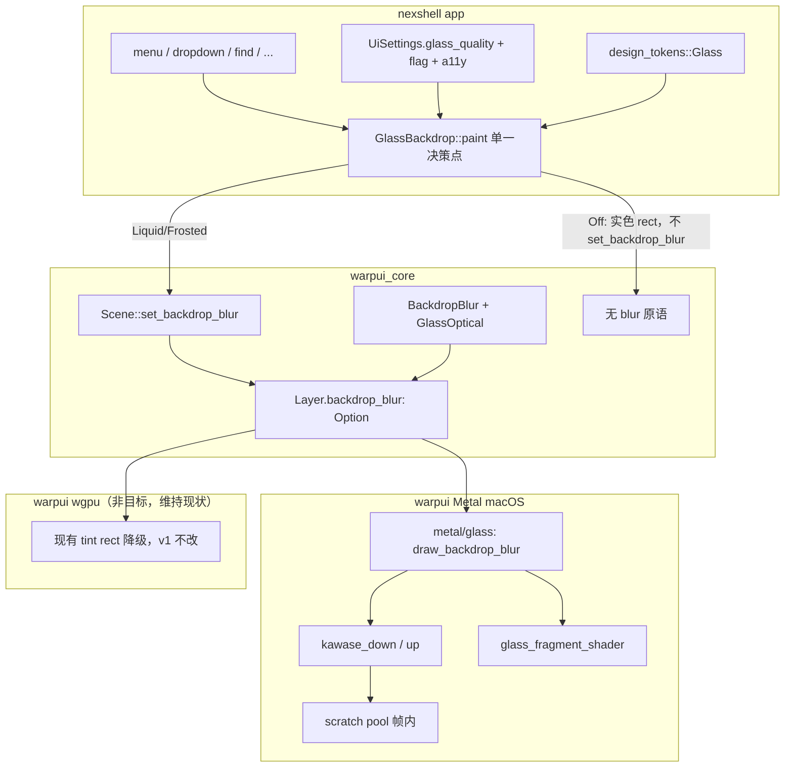
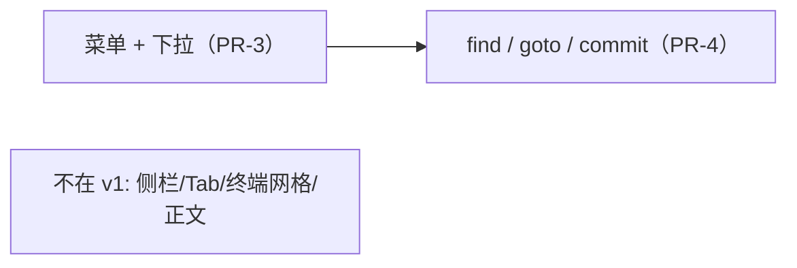
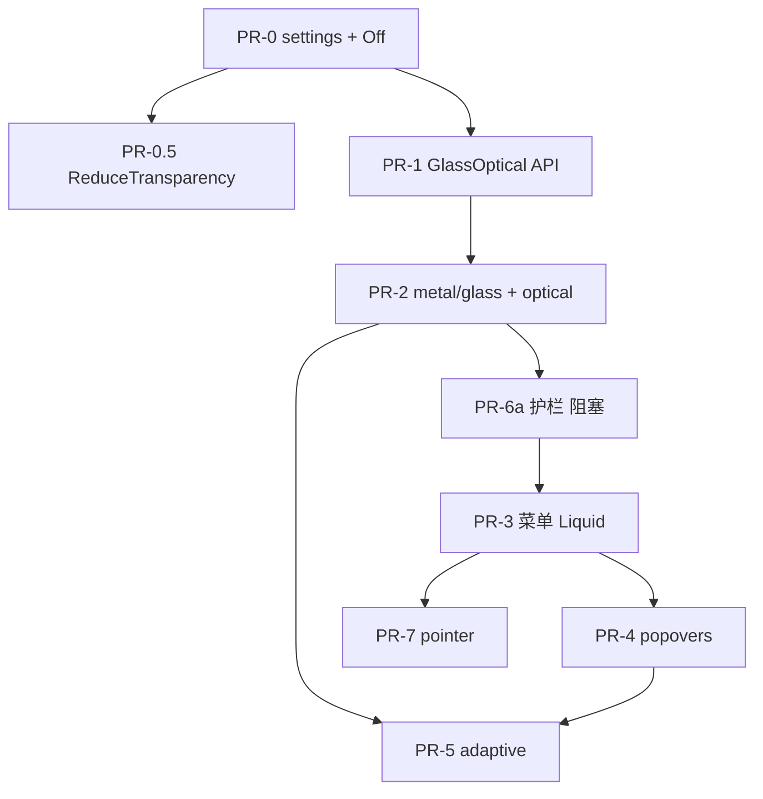

# Liquid Glass UI via Metal（nexshell / warpui）

| 字段 | 内容 |
|------|------|
| **作者** | nexshell engineering |
| **日期** | 2026-07-08 |
| **状态** | Rev.4（PR-3 实测后 Phase 1.5 提前落地） |
| **主目标平台** | macOS Metal backend |
| **非目标平台** | Windows / 非 Metal：维持现有 tint 降级，**不做** Liquid |
| **相关 crate** | `nexshell`、`warpui`、`warpui_core` |

---

## Overview

nexshell 已具备 **Frosted Glass** 基础设施：app 层通过 `GlassBackdrop` 声明 `BackdropBlur`，macOS Metal 后端以 Dual Kawase 金字塔采样下层画面，再经 `glass_fragment_shader` 做饱和度 + tint + 圆角 SDF 合成。这不是系统级 Liquid Glass，也尚未包含折射、高光、厚度感知与形态动画。

本设计提出在 **现有 Metal 玻璃管线之上** 分阶段实现 **高保真光学玻璃（Liquid Glass 风格）**：保留 Dual Kawase 作为 soft scatter 基底，在 composite 阶段增加 SDF 法线折射、边缘 specular、厚度/elevation 耦合、自适应对比与（可选）指针响应高光；**不追求** macOS 系统 compositor 像素级一致。

**v1 产品范围（Rev.2 拍板）**：仅 **浮层**——菜单 / 下拉 / find / goto / commit 详情。侧栏与 Tab **不进路线图**。终端主内容区 **禁止**全窗玻璃。Windows 不做 Liquid。v1 **不做**跨帧 blur cache、**不做** morph 动画。

**Rev.1 工程修正（仍有效）**：

1. Phase 1–4 **默认每帧仍跑 Dual Kawase**；「跳过 Kawase」**不是**现行架构免费能力；v1 **不做** blur cache。
2. 光学公式与常量 **规范定义**，Phase 1 可复现。
3. **最小性能护栏（PR-6a）必须先于** 菜单启用 Liquid（PR-3）。
4. `glass_quality=Off` 的单一决策点与现有 `UiSettings` 接线写死。

**Rev.3 审查修订（2026-07-08，代码事实核对全数通过）**：

1. **滚动降级加迟滞 + dirty 粒度定义**（§7.1）：禁止逐帧 liquid↔frosted 跳变；光标闪烁不计入 dirty，否则 find bar 常驻场景永远 frosted。
2. **Reduce Transparency 强制 Off**（原 ≤ frosted 语义错位）：frosted 仍是透明模糊，违背该 a11y 设置本意。
3. **PR-0.5 探测 API 更正**：`NSWorkspace.accessibilityDisplayShouldReduceTransparency` + 变更通知；不读 `UserDefaults`（`com.apple.universalaccess` 域普通 app 读不到）。
4. 小修：`light_dir` 默认值归一化、`resolve_glass` 去掉 backend 入参、§4 删「或直接 solid」、`rim` 去掉 no-op `pow`、Off 路径明确圆角与 own_layer 行为、adaptive luma 折射耦合备注。

**Rev.4 实测修订（2026-07-09，PR-3 落地后视觉验收驱动）**：

PR-3 实测菜单呈「白磨砂板」，与 Apple Liquid Glass 识别度差距归因三点：折射峰值仅 ~1px（0.05×0.85×24）不可见、rim 纯加白在浅色主题被 saturate 削平、tint 0xc0 透射过低。修订：

1. **Phase 1.5 crisp 边缘折射提前进 v1**（原「非 MVP 默认关」作废）：`GlassOptical.crisp_mix` 新字段；边缘环带 `crisp_w = crisp_mix × edge²` 混入未模糊采样，环带内 tint 权重 `×(1 − crisp_w×0.7)` 削弱——透镜环带透出近原色背景。
2. **原 §3.3「main_target 仅作 texture(1) 采样源」设想有误**：composite pass 的 color attachment 就是 main_target，同 pass 采样属 Metal 读写冲突。as-built 方案：suspend_main 期间用 `MTLBlitCommandEncoder` 把 padded 区拷入 scratch（crisp copy），composite 绑该拷贝为 texture(1)；仅 resolved optical active 且 crisp_mix > EPS 时付拷贝成本。已知次像素误差：blit 源 origin 取 floor，与 fractional blur_origin 的 UV 映射可差 ≤1px，可接受。
3. **rim 改明暗双色**：`RIM_DARK_RATIO=0.45`，亮项沿 light_dir、暗项反向（浅色主题靠暗边呈现轮廓）。
4. **Liquid 专用 tint**：`Glass.liquid_tint_alpha`（overlay 0x73 / popover 0x96），frosted `tint_alpha` 0xc0/0xd2 不动（bit-compat）。`ior_delta` 0.05→0.28 / 0.035→0.18（折射峰值 ~5.7px 打满 clamp）。
5. 以上数值为**初值，待运行期视觉调参后回钉**；shader as-built 以 `shaders.metal` 为准，本文 §3.2 代码块代表 Phase 1 原始规范。

---

## Background & Motivation

### 当前状态（代码事实）

**1. nexshell app 层**

- [`nexshell/src/glass_backdrop.rs`](file:///Users/matt/SynologyDrive/code/vpstools/nexshell/src/glass_backdrop.rs)：`GlassBackdrop` Element  
  - `paint` 时调用 `ctx.scene.set_backdrop_blur(...)`  
  - `with_own_layer()`：与宿主同层时自开 `start_layer`，保证模糊能采到本层之下已绘内容  
  - 独立 overlay 层（菜单等）保持 `own_layer = false`
- [`nexshell/src/design_tokens/elevation.rs`](file:///Users/matt/SynologyDrive/code/vpstools/nexshell/src/design_tokens/elevation.rs)：`Glass { radius, saturation, tint_alpha }`  
  - `Glass::overlay()`：`radius=24, saturation=1.4, tint_alpha=0xc0`  
  - `Glass::popover()`：`radius=18, saturation=1.3, tint_alpha=0xd2`  
  - `Glass::backdrop(...)` 组装 `warpui_core::scene::BackdropBlur`（**全仓库结构化构造的主路径**；另一处为 `scene_tests.rs`）
- **已接入表面**（直接包 `GlassBackdrop`，**无**平行实色路径）：`menu.rs`、`warp_dropdown.rs`、`root_view/find_section.rs`（+`with_own_layer`）、`code_editor/find`、`goto_line`、`git_commit_detail_helpers.rs`

**2. warpui_core scene API**

[`warp/crates/warpui_core/src/scene.rs`](file:///Users/matt/SynologyDrive/code/vpstools/warp/crates/warpui_core/src/scene.rs)：

```rust
pub struct BackdropBlur {
    pub rect: RectF,
    pub corner_radius: f32,
    /// 模糊半径（决定 Dual Kawase 迭代深度）。
    pub radius: f32,
    pub tint: ColorU,
    pub saturation: f32,
}

// Layer 每层最多一个：
pub backdrop_blur: Option<BackdropBlur>,

// 声明点：
pub fn set_backdrop_blur(&mut self, blur: BackdropBlur)
```

层绘制顺序：`layers` 后接 `overlay_layers`；每层先处理 `backdrop_blur`，再 clip / rects / quads / rings / decorations / images / glyphs。

**3. Metal 真模糊（可扩展基座）**

[`warp/crates/warpui/src/platform/mac/rendering/metal/renderer.rs`](file:///Users/matt/SynologyDrive/code/vpstools/warp/crates/warpui/src/platform/mac/rendering/metal/renderer.rs) — `Frame::draw_backdrop_blur`：

1. 逻辑 rect × scale → device rect；按 `radius` **外扩 padded 采样区**
2. radius → Dual Kawase 迭代（1–4 级，保证最深层 ≥4px）
3. `suspend_main` → 离屏 scratch 金字塔（`acquire_scratch` 池；**`reset_scratch_for_frame` 每帧清占用，blur result 不跨帧保留**）
4. `kawase_down` / `kawase_up` 全屏三角 pass
5. `resume_main(Load)` → `glass_pipeline_state` 把 result 纹理按圆角回贴

**关于 offscreen RT（避免误解）**：存在的 `offscreen_targets` 是 **整窗主渲染目标**（可采样 + present blit 源），**不是** per-layer 内容 cache，也 **不能** 充当「跳过 Kawase 的 blurred result 缓存」。当前架构下 **无**「下层未脏则跳过重绘 / 跳过 blur」的 scene dirty API。

Shader：[`shaders.metal`](file:///Users/matt/SynologyDrive/code/vpstools/warp/crates/warpui/src/platform/mac/rendering/metal/shaders/shaders.metal)

- `kawase_down_fragment_shader` / `kawase_up_fragment_shader`
- `glass_fragment_shader`：采样 blurred → luma 饱和度 → tint mix → `distance_from_rect` SDF alpha

Uniforms：[`shader_types.h`](file:///Users/matt/SynologyDrive/code/vpstools/warp/crates/warpui/src/platform/mac/rendering/metal/shaders/shader_types.h) 中 `GlassUniforms { origin, size, blur_origin, blur_size, tint, corner_radius, saturation }`

**4. wgpu 降级**

[`warp/crates/warpui/src/rendering/wgpu/renderer/rect.rs`](file:///Users/matt/SynologyDrive/code/vpstools/warp/crates/warpui/src/rendering/wgpu/renderer/rect.rs)：无离屏采样链；`backdrop_blur` 变成 **提高 alpha 的实心 tint rect**（`tint.a = 255 - (255 - tint.a) / 3`），仅保可读与遮挡。

**5. 相关但正交的系统**

- 窗口透明度：`RootView::apply_window_opacity` → macOS `set_window_alpha`（整窗 alpha，**不是** content 玻璃材质）；持久化字段为 `ui_settings.json` 顶层 `opacity`（**无** `ui.` 嵌套前缀）
- Feature flags：`nexshell/src/features.rs` 复用 `warp_core::features::FeatureFlag`（`warp_features` 大枚举）；无现成 glass flag
- 扩展风格先例：`scene::Quad` / `scene::Ring` 走「scene 原语 + Metal 专用 pipeline + wgpu 有则实现/无则忽略」；backdrop 是 **per-layer 单例**

### 痛点

| 痛点 | 说明 |
|------|------|
| 视觉停留在「毛玻璃」 | 缺折射 lensing、rim 高光、厚度差异 |
| 参数维度不足 | `Glass` 只有 radius/saturation/tint_alpha |
| 性能未分层 | 任意 glass 每帧完整 Kawase；find bar + 终端滚动是真实热路径 |
| 跨后端语义分裂 | Metal 真模糊 / wgpu 实心 tint |
| 可读性风险 | 过强折射/过低 tint 伤终端字色对比 |
| Off 路径缺失 | call site 一律 `GlassBackdrop`，无实色回退分支 |

---

## Goals & Non-Goals

### Goals

1. 在 **macOS Metal** 上实现可辨识的 Liquid Glass 光学效果（折射 + rim + 厚度 + 可选自适应 tint + 可选指针高光）
2. **增量可合并**：每一阶段独立可 ship、可 flag/settings 关闭回退到现有 frosted
3. **复用** Dual Kawase、`suspend_main`/`resume_main`、scratch 池、`GlassBackdrop` 接入模式
4. **v1 仅浮层**：菜单 / 下拉 / find / goto / commit；**禁止**全窗内容区玻璃；侧栏/Tab 不进 v1
5. 明确性能预算、热路径策略、Reduce Transparency / 低功耗
6. **强制模块化**：PR-2 起将 glass 从 `renderer.rs`（~2089 行）迁出 `metal/glass/`，避免继续膨胀

### Non-Goals

- macOS 系统 Liquid Glass / `NSVisualEffectView` 像素级一致
- 用系统 vibrancy 替换 in-app Metal 管线
- **Windows / 非 Metal 上的任何 Liquid 规划**（维持现有 wgpu tint 降级即可，不改进、不 parity）
- 侧栏 / Tab / 常驻 chrome 玻璃
- 跨帧 blur cache / 跳过 Kawase（v1 不做；远期未排期）
- Phase 5 morph / 连续 chrome 形变动画（**不立项**）
- 物理级光线追踪 / 多层体积散射
- 整窗 wallpaper 式背景替换
- 把 glass 绑死到 GPUI 上游合并节奏

---

## Proposed Design

### 1. 架构决策：扩展 `BackdropBlur`，不新建平行原语

**推荐：扩展现有 `BackdropBlur` + 可选光学参数块。**

| 方案 | 优点 | 缺点 |
|------|------|------|
| **A. 扩展 `BackdropBlur`（推荐）** | 单一 `Layer.backdrop_blur`；`set_backdrop_blur` 不变；双后端分派唯一；默认 = 今日 frosted | 结构体略胖 |
| B. 新 `LiquidGlass` + 双 Option | 语义清晰 | 互斥双字段、双重分派 |
| C. 泛化 `Material` enum | 长期优雅 | 一期过重 |

**构造点影响面（排期用）**：当前仅 `Glass::backdrop`（`elevation.rs`）+ `scene_tests.rs` 两处结构化构造；call site 不直接拼 `BackdropBlur`。

建议数据结构（`warpui_core::scene`）：

```rust
/// 光学玻璃参数；Default = 既有 frosted composite（不 is_active）。
/// 注意：仅 scene 运行时描述，**禁止** serde 进 settings JSON。
#[derive(Clone, Copy, Debug)]
pub struct GlassOptical {
    /// 厚度 [0,1+]：驱动折射强度与边缘 falloff。
    pub thickness: f32,
    /// 相对折射率强度；0 = 不折射。典型 0.02..0.08。
    pub ior_delta: f32,
    /// 边缘高光强度 [0,1]。
    pub specular: f32,
    /// 屏幕空间 2D 光方向；CPU 构造时必须归一化（shader 侧 normalize 仅兜底）。
    /// Phase 1 固定，PR-7 可覆写。
    pub light_dir: Vector2F,
    /// 是否启用自适应 tint 权重（Phase 3）。
    pub adaptive_contrast: bool,
}

const OPTICAL_EPS: f32 = 1e-4;

impl Default for GlassOptical {
    fn default() -> Self {
        Self {
            thickness: 0.0,
            ior_delta: 0.0,
            specular: 0.0,
            // Phase 1 写死默认；pointer 混合留给 PR-7，不在 Phase 1 引入第二光场字段。
            // (0.35, -0.75) 的归一化结果（三位小数，模长 0.9999）——存归一化值，与契约一致。
            light_dir: vec2f(0.423, -0.906),
            adaptive_contrast: false,
        }
    }
}

impl GlassOptical {
    pub fn is_active(self) -> bool {
        self.thickness > OPTICAL_EPS
            || self.ior_delta > OPTICAL_EPS
            || self.specular > OPTICAL_EPS
            || self.adaptive_contrast
    }
}

pub struct BackdropBlur {
    pub rect: RectF,
    pub corner_radius: f32,
    pub radius: f32,
    pub tint: ColorU,
    pub saturation: f32,
    pub optical: GlassOptical, // Default = frosted-only
}
```

单测要求：`GlassOptical::default().is_active() == false`；`BackdropBlur` 可 `optical: GlassOptical::default()`。

**nexshell token 层**（`design_tokens/elevation.rs`）：

```rust
pub struct Glass {
    pub radius: f32,
    pub saturation: f32,
    pub tint_alpha: u8,
    pub thickness: f32,   // default 0
    pub ior_delta: f32,   // default 0
    pub specular: f32,    // default 0
    pub adaptive_contrast: bool, // default false；Phase 3 才由 preset 打开
}

impl Glass {
    /// 按解析后的有效档位生成 optical（见 §5 优先级）。
    pub fn optical_for(&self, effective: EffectiveGlass) -> GlassOptical { /* ... */ }
}
```

#### Preset 表（Phase 1–2 锁定视觉）

| Preset | 角色 | radius | tint_α (frosted) | liquid_tint_α | thickness | ior_delta | specular | crisp_mix | adaptive | light_dir |
|--------|------|--------|--------|--------|-----------|-----------|----------|----------|----------|-----------|
| `overlay()` | 菜单/下拉 | 24 | 0xc0 | 0x73 | 0.85 | 0.28 | 0.55 | 0.85 | false→P3 true | (0.423,-0.906) |
| `popover()` | 查找/goto/commit | 18 | 0xd2 | 0x96 | 0.55 | 0.18 | 0.35 | 0.6 | false→P3 true | 同上 |
| `frosted_only()` | flag 关 / 热路径降级（a11y 走 Off 实色，不落此档） | 同旧 | 同旧 | — | 0 | 0 | 0 | 0 | false | 同上 |

> Rev.4：liquid_tint_α / ior_delta / crisp_mix 为实测修订初值，待视觉调参回钉；frosted 列 bit-compat 不动。

> **v1 不引入** `chrome()` preset（侧栏/Tab 已取消）。

Shader 侧固定常量见 **§3.2 Normative**（不进 token，避免每控件漂移）。

`GlassBackdrop` 仍是唯一 app 接入点；**Off / Frosted / Liquid 分支在其内部完成**（见 §5），call site 不必双路径。

### 2. API 分层



| 层 | 职责 | 禁止 |
|----|------|------|
| Metal private | pass 编排、pipeline、uniforms、scratch | 不知 nexshell token |
| `warpui_core` public | 逻辑坐标 scene 描述 | 不 import Metal；不 serde 光学参数 |
| nexshell tokens + `GlassBackdrop` | 产品预设、quality 决策、own_layer | 不直接碰 shader |
| wgpu | **v1 不规划 Liquid**；保留现有 tint fallback | 不为 Windows 加 rim/min-alpha 专项 |

### 3. Shader 设计

#### 3.1 扩展 `GlassUniforms`（C / bindgen）

```c
typedef struct {
  vector_float2 origin;      // 设备像素
  vector_float2 size;
  vector_float2 blur_origin;
  vector_float2 blur_size;
  vector_float4 tint;
  float corner_radius;
  float saturation;
  // --- Liquid Glass optical（设备像素空间）---
  float thickness;
  float ior_delta;
  float specular;
  float adaptive;            // 0.0 or 1.0
  vector_float2 light_dir;   // CPU 构造时已归一化；shader normalize 仅兜底
  float edge_thickness_scale;// 默认 EDGE_THICKNESS_SCALE
  float max_refract_px;      // 默认 MAX_REFRACT_PX
  float refract_px_ref;      // 默认 REFRACT_PX_REF
  float spec_exp;            // 默认 SPEC_EXP
} GlassUniforms;
```

Rust 侧构造时：若 `!optical.is_active()`，光学 float 全 0、`adaptive=0`，并走 early path。`build.rs` 已 allowlist `GlassUniforms`。

常量默认值（可写死进 `GlassUniforms::new` 的 default 参数；**不**暴露到 settings）：

| 常量 | 值 | 含义 |
|------|-----|------|
| `SDF_NORMAL_EPS_PX` | `1.0` | 设备像素有限差分步长 |
| `EDGE_THICKNESS_SCALE` | `12.0` | `edge_soft = max(2, thickness * scale)` |
| `REFRACT_PX_REF` | `24.0` | 折射偏移参考像素（与 size **解耦**） |
| `MAX_REFRACT_PX` | `6.0` | 折射偏移绝对值硬 clamp |
| `SPEC_EXP` | `32.0` | rim 指数 |
| `ADAPTIVE_LUMA_LO` | `0.15` | 过暗抬升起点 |
| `ADAPTIVE_LUMA_HI` | `0.85` | 过亮抬升终点 |
| `ADAPTIVE_LIFT` | `0.22` | tint 权重最大附加比例 |
| `OPTICAL_EPS` | `1e-4` | 与 Rust `is_active` 一致 |

#### 3.2 Normative composite algorithm（Phase 1 必须按此实现）

**坐标系**：所有 `origin/size/pixel/corner_radius` 与现有 glass shader 一致，均为 **设备像素**（逻辑 × `scale_factor` 已在 CPU 完成）。

**语义声明（Phase 1）**：折射 **仅** 采样 **已模糊** 的 `blurred` 纹理 → 效果是 **软/厚玻璃 lensing**，**不是**「透镜下仍见清晰下层字」。`SourceAlpha` 混合下 glass 内部 alpha≈1 **完全覆盖**下层；用户看到的「弯曲」是 blurred 内容的位移，而非 crisp backdrop。

**Zero-optical early path（bit-identical 要求）**：当 `thickness|ior_delta|specular|adaptive` 均 ≤ `OPTICAL_EPS` 时，fragment **必须**与当前 `glass_fragment_shader` **逐行同构**：

```metal
// === EARLY / FROSTED PATH（与 2026-07 现网一致）===
float2 uv = (in.pixel_position - g.blur_origin) / g.blur_size;
float4 color = blurred.sample(s, uv);
float luma = dot(color.rgb, float3(0.2126, 0.7152, 0.0722));
color.rgb = mix(float3(luma), color.rgb, g.saturation);
color.rgb = mix(color.rgb, g.tint.rgb, g.tint.a);
float2 corner = g.size / 2.0;
float dist = distance_from_rect(in.pixel_position, g.origin + corner, corner, g.corner_radius);
return float4(color.rgb, saturate(0.5 - dist));
```

PR-2 验收：zero-optical 下固定场景截图 vs 旧 binary，**最大通道差 ≤ 2/255**（允许 dither/精度）；或 frame capture 抽样。

**Full optical path**：

```metal
constexpr sampler s(coord::normalized, address::clamp_to_edge, filter::linear);

float2 half_size = g.size * 0.5;
float2 center = g.origin + half_size;
float d = distance_from_rect(in.pixel_position, center, half_size, g.corner_radius);

// --- SDF 法线：设备像素有限差分（与 distance_from_rect 同源）---
// 解析梯度更省，但有限差分实现简单且与 SDF 定义严格一致；ε = SDF_NORMAL_EPS_PX。
float eps = 1.0; // SDF_NORMAL_EPS_PX
float ddx = distance_from_rect(in.pixel_position + float2(eps, 0), center, half_size, g.corner_radius)
          - distance_from_rect(in.pixel_position - float2(eps, 0), center, half_size, g.corner_radius);
float ddy = distance_from_rect(in.pixel_position + float2(0, eps), center, half_size, g.corner_radius)
          - distance_from_rect(in.pixel_position - float2(0, eps), center, half_size, g.corner_radius);
float2 n = float2(ddx, ddy);
float nlen = length(n);
n = (nlen > 1e-5) ? (n / nlen) : float2(0, 0);

// --- 边缘权重 ---
float edge_soft = max(2.0, g.thickness * g.edge_thickness_scale);
float edge = saturate(1.0 - abs(d) / edge_soft);

// --- 折射：与面板 size 解耦，固定像素尺度 + clamp ---
// 注意：不要用 max(size) 放大，避免 800px 宽 chrome 出现 ~34px 脏边。
float refract_mag = g.ior_delta * g.thickness * edge * g.refract_px_ref;
refract_mag = clamp(refract_mag, -g.max_refract_px, g.max_refract_px);
float2 refract_offset = n * refract_mag; // 设备像素
float2 uv = (in.pixel_position + refract_offset - g.blur_origin) / g.blur_size;
// clamp_to_edge：大 offset 可能拖边；靠 MAX_REFRACT_PX 抑制。不扩展采样区（padded 已按 blur radius）。
float4 color = blurred.sample(s, uv);

// --- 饱和度（同 frosted）---
float luma = dot(color.rgb, float3(0.2126, 0.7152, 0.0722));
color.rgb = mix(float3(luma), color.rgb, g.saturation);

// --- tint + adaptive contrast ---
// 顺序：先 sat，再按有效权重混 tint（与 frosted 一致，仅权重可抬升）。
float tint_w = g.tint.a;
if (g.adaptive > 0.5) {
    // 过暗或过亮时略增 tint，抬可读性；不改 tint 色相。
    // 注意 luma 取自折射偏移后的采样点：边缘处 tint 权重随折射空间不均匀，
    // 极端背景可能出现 tint 条纹——已由 8 格可读性清单覆盖，排查时知道此因果链。
    float t_lo = 1.0 - smoothstep(0.0, ADAPTIVE_LUMA_LO, luma);
    float t_hi = smoothstep(ADAPTIVE_LUMA_HI, 1.0, luma);
    float lift = saturate(t_lo + t_hi) * ADAPTIVE_LIFT; // 0..0.22
    tint_w = saturate(tint_w * (1.0 + lift));
}
color.rgb = mix(color.rgb, g.tint.rgb, tint_w);

// --- 2D rim specular（可控，非完整 Blinn）---
// 主项：沿 SDF 边缘的能量；副项：与 light_dir 对齐的方位调制。
float rim = edge; // edge 已含厚度；如需更锐 rim 曲线再引入指数常量，不写 pow(x,1)
float2 L = normalize(g.light_dir);
// 法线朝外；光从左上时亮边。
float az = pow(saturate(dot(n, L)), g.spec_exp);
float spec = g.specular * rim * (0.35 + 0.65 * az);
// 仅加到 rgb，不影响 alpha（避免边缘变实心遮挡感突变）
color.rgb = color.rgb + spec * (1.0 - tint_w * 0.5);
color.rgb = saturate(color.rgb);

// --- alpha 与 frosted 同构 ---
return float4(color.rgb, saturate(0.5 - d));
```

**折射尺度决策（关闭 Open Question 7 的实现歧义）**：`ior_delta` / `REFRACT_PX_REF` / `MAX_REFRACT_PX` 均在 **设备像素** 解释；CPU 不因 scale 再乘一遍。逻辑预设数值跨 @1x/@2x 观感接近（都是「几 px 级」弯曲）。

#### 3.3 Pass 图

```mermaid
flowchart LR
  subgraph main_pre ["Main pass 已绘内容"]
    Content["下层 layers 像素 in main_target"]
  end

  subgraph blur_pyramid ["Offscreen Dual Kawase（Phase1-4 每帧）"]
    Suspend["suspend_main"]
    Capture["Sample padded region from main_target"]
    Down["kawase_down × N"]
    Up["kawase_up × N → result"]
  end

  subgraph composite ["Resume main + glass"]
    Resume["resume_main Load"]
    Optical["normative optical or early frosted"]
    Write["SourceAlpha blend into main_target"]
  end

  subgraph after ["本层 content"]
    Rects["rects / quads / rings / glyphs ..."]
  end

  Content --> Suspend --> Capture --> Down --> Up --> Resume
  Resume --> Optical --> Write --> Rects
```



**不新增**独立 refraction pass / G-buffer（Phase 1–4）。

**Phase 1.5 crisp 边缘混合（Rev.4 已落地进 v1）**：

- ~~`suspend_main` 后 `main_target` 仅作 `texture(1)` 采样源~~ **原设想有误**（同 pass 读写冲突，见 Rev.4 修订第 2 条）；as-built 为 blit crisp copy → texture(1)
- `GlassUniforms.crisp_mix`；边缘环带 `crisp_w = crisp_mix × edge²` + 环带 tint 削弱
- 实现位于 `metal/glass/mod.rs`（`copy_crisp_region`）+ `shaders.metal` full optical path

#### 3.4 边界行为

| 行为 | 约定 |
|------|------|
| UV 出 blurred 范围 | `clamp_to_edge` → 可能拖色；靠 `MAX_REFRACT_PX=6` 限制 |
| glass 内部是否透出清晰字 | **否**（Phase 1）；软折射 |
| alpha | 与 frosted 相同 SDF；specular **不加** alpha |
| 多层 glass | 各自独立 Kawase；禁止嵌套期望「透过上层看下层玻璃光学叠加」 |

### 4. Metal renderer 实现要点

1. 现有 padded + iterations + pyramid **保持**（Phase 1–4 每帧执行）
2. `GlassUniforms` 填入 optical + 常量默认
3. 同帧 **glass 计数器**（PR-6a）：第 4 个起强制 `optical` 清零仍跑 frosted Kawase（与 §7.3 一致；无 solid 档）
4. **强制拆分**（PR-2 内完成，非「以后再说」）：

```
metal/
  glass/
    mod.rs              // draw_backdrop_blur 编排、计数降级
    uniforms.rs         // GlassUniforms 构造
  shaders/shaders.metal // glass / kawase 可暂留同文件
  renderer.rs           // 调用 glass::draw_backdrop_blur
```

### 5. Feature flag / 设置与 Off 路径

#### 5.1 持久化

与现有 `opacity` 同级，**顶层**字段（**不是** `ui.glass_quality` 嵌套）：

```json
{
  "opacity": 100,
  "glass_quality": "frosted"
}
```

| 值 | 含义 |
|----|------|
| `off` | 无 blur；实色底板 |
| `frosted` | Kawase + tint；optical 全 0（**缺省 / 迁移默认**） |
| `liquid` | Metal 上启用 preset optical |

**必改文件（PR-0）**：

- `ui_settings` 定义与 serde（项目内实际路径，如 `src/ui_settings.rs` 或等价）
- `settings_view/appearance_page.rs` — 控件与文案
- `root_view/settings_section.rs` — 加载/保存/apply
- `TerminalGridAction`（或现有 settings action 枚举）— `SetGlassQuality`
- locales（i18n key）
- 可选：开发用 env / 本地 bool `liquid_glass_enabled` 总闸（**不**强行改 `warp_features` 巨型枚举）

**macOS 专属**：设置页 `liquid` 档仅对 Metal 有光学意义。非 macOS 构建可不展示 Liquid，或展示但运行时强制 ≤ frosted（**不**为 Windows 做专用观感工程）。

#### 5.2 优先级（高 → 低）

```text
1. 系统 Reduce Transparency == true（若已探测）  → 强制 Off（实色；与系统 a11y 语义一致，
   frosted 仍是透明模糊，不满足「减少透明度」的本意）
2. 开发/release feature 总闸 == off              → 强制 ≤ frosted（忽略用户 liquid）
3. 用户 glass_quality
4. 后端能力：非 Metal → optical 忽略（维持现有 tint；**v1 不做** min-alpha/rim 专项）
   —— 该条在 renderer 侧天然成立：wgpu 根本不读 optical 字段，app 层无需感知后端
5. 运行时热路径降级（§7.1）→ optical 清零（带迟滞窗口，见 §7.1）
```

**拍板（关闭原 Open Question 4 的交付歧义）**：

- **PR-0 必须**：用户 Off / Frosted / Liquid 三档（默认 Frosted）
- **PR-0.5 或 PR-3 附带（推荐 PR-0.5）**：macOS 用 `NSWorkspace.accessibilityDisplayShouldReduceTransparency` 探测，并监听 `NSWorkspace.accessibilityDisplayOptionsDidChangeNotification` 响应运行时切换。**不读** `UserDefaults` 的 `AppleReduceTransparency`——它在 `com.apple.universalaccess` 域，普通 app 大概率读不到。API 不可用时 no-op，用户 Off 已覆盖 a11y 最低线

#### 5.3 单一决策点：`GlassBackdrop::paint`

```rust
// 伪代码 — 唯一 Off/Frosted/Liquid 分支
// 无 backend 入参：wgpu 不读 optical 字段，优先级第 4 条在 renderer 侧天然成立，
// app 层不需要（也不该去找）「查询当前后端」的 API。
let effective = resolve_glass(quality, flag, reduce_transparency);
match effective {
    EffectiveGlass::Off => {
        // 不 set_backdrop_blur；own_layer 亦不 start_layer（无采样需求，行为写死避免歧义）
        // 实色底板必须带 corner_radius（scene::Rect 圆角），否则 Off 档浮层变直角
        // 底色：tint_base.with_alpha(0xFF) 或主题不透明背景
        // child 照常 paint（call site 保持透明 child 亦可，因底板已实色）
        ctx.scene.draw_rounded_rect(solid_rect, corner_radius);
        self.child.paint(...);
    }
    EffectiveGlass::Frosted => {
        let blur = self.glass.backdrop(...); // optical = default
        ctx.scene.set_backdrop_blur(blur);
        self.child.paint(...);
    }
    EffectiveGlass::Liquid => {
        let mut blur = self.glass.backdrop(...);
        blur.optical = self.glass.liquid_optical(); // preset 非零
        // 热路径可由 Frame 侧再清 optical；此处仍声明 Liquid
        ctx.scene.set_backdrop_blur(blur);
        self.child.paint(...);
    }
}
```

**不**要求每个 call site（menu/find/…）写双路径。

### 6. 表面采用策略（UI rollout）



| 表面 | 文件 | own_layer | preset | 备注 |
|------|------|-----------|--------|------|
| 菜单 | `menu.rs` | false | `overlay` | 偶发；冷路径 |
| 下拉 | `warp_dropdown.rs` | false | `overlay` | 偶发 |
| 终端 find | `find_section.rs` | **true** | `popover` | **热路径**（+网格滚动） |
| 编辑器 find/goto | `code_editor/...` | false | `popover` | 中频 |
| commit 详情 | `git_commit_detail_helpers.rs` | false | `popover` | 偶发 |
| Tab/侧栏 | — | — | — | **v1 取消，不进路线图** |

### 7. 性能预算

#### 7.1 热路径矩阵

| 场景 | 期望 Kawase 次数/帧 | optical | 策略 |
|------|---------------------|---------|------|
| 静态菜单打开（终端空闲） | 1（菜单层） | 允许 Liquid | High |
| 菜单 + 子菜单 | 2 | 允许；第 4 起降级 | 计数护栏 |
| **find bar + 终端滚动/输出** | **每帧 1**（find own_layer） | **降级窗口内清零 optical**（仍 frosted Kawase） | 见下「滚动降级（带迟滞）」 |
| find + 终端 idle | 1 | 允许 Liquid | High/Medium |
| 多 dropdown 叠菜单 | 2–3 | ≤3 optical | 计数 |

**滚动降级（带迟滞；可操作，非空泛「帧预算」）**：

```text
若 glass_quality==Liquid
  且 降级窗口 active（定义见下）
  且 存在至少一块 BackdropBlur
则 Metal draw_backdrop_blur 将 optical 视为 default（frosted），仍跑 Kawase。
```

**dirty 粒度定义（PR-6a 验收项，防闪烁）**：

| 规则 | 内容 |
|------|------|
| 计入 dirty | 可见终端网格的 scroll / 新输出行 / resize |
| **不计入** | **光标闪烁**、IME 预编辑、glass 浮层自身重绘——否则 find bar 常驻场景永远 frosted，Phase 2「降级可观察」退化成「永远降级」 |
| 范围 | 仅**当前可见 pane** 的网格 dirty；全局帧标志实现亦可，但**后台 tab 输出不得置位**（否则后台 `tail -f` 会拖累前台菜单） |
| 迟滞 | dirty 置位 → 立即降级；dirty 消失 → **保持降级 ≥ 300ms 再恢复** optical（或恢复时对 optical 权重做 4–6 帧线性淡入）。**禁止逐帧 liquid↔frosted 跳变**——终端输出是间歇性的，无迟滞时折射/rim 高频闪烁比恒定 frosted 更难看 |
| 恢复时机 | 渲染是 damage-driven：恢复 optical 依赖后续自然重绘帧（光标闪烁虽不置 dirty 但会产生帧，≤ 闪烁周期内即恢复）；完全静止时停在 frosted 直到下一帧，**可接受，不要求主动 schedule 重绘** |

不依赖「上一帧 ms 是否超 16.7」的反馈环（难校准）；用 **内容 dirty 启发式 + 迟滞窗口**，实现简单、行为可预测。

#### 7.2 Dirty / Cache 诚实模型（v1）

| 级别 | 含义 | v1 |
|------|------|-----|
| **每帧全量（基线）** | 下层重绘进 main_target → 必 Kawase → composite | **采用** |
| **L0** | 整窗/层内容跳过重绘 | **不存在** per-layer 内容 cache；勿假设 |
| **L1 跳过 Kawase** | 仅 light_dir 变，复用跨帧 blur result | **v1 不做**（产品拍板；远期未排期） |

**v1 策略**：承认 **每帧仍跑 Kawase**。pointer（PR-7）仅改 `light_dir` 的收益是 **composite ALU**，**不能**省掉模糊；成功标准为「视觉跟手 + 可关」，**不**承诺「移指针不重跑 Kawase」。

> 跨帧 `glass_blur_cache` 曾作为评审后可选方案记录，**第一个发布周期明确取消**。若未来重开，需单独设计 key/失效/`reset_scratch_for_frame` 关系，不在本文 v1 交付内。

#### 7.3 质量档与护栏（PR-6a，**阻塞 PR-3**）

| 档 | Kawase iter | optical | 触发 |
|----|-------------|---------|------|
| High | 现有 radius 映射 | 全 | Liquid + idle + 计数允许 |
| Medium | max(1, iter-1) | 折射/高光 ×0.5 | 可选设置 / 多 glass |
| Low | min iter | 强制 frosted | 滚动降级、低电量、计数超限 |
| Off | 无 | 无 | glass_quality=off |

同帧 **optical-active glass ≤ 3**；超出 → 额外的按 Low（frosted）。

预算（**Phase 0 先测基线**，数字为初始目标而非拍脑袋验收闸）：

| 项 | 初始目标 | 说明 |
|----|----------|------|
| 当前 frosted find + 滚动 | 记录 `gpu.execute` p50/p95 | Phase 0 产出 |
| 单 glass Kawase 增量 | 相对基线 +0.5–1.5 ms 量级 | M 系列参考 |
| optical ALU | ≪ Kawase | 非主矛盾 |

### 8. 回退与可访问性

| 条件 | 行为 |
|------|------|
| `glass_quality=off` | `GlassBackdrop` 实色圆角 rect；无 `set_backdrop_blur` |
| 系统 Reduce Transparency | **强制 Off**（实色；与系统 a11y 语义一致） |
| `frosted` / flag off | optical 清零；Metal blur |
| `liquid` + Metal + 护栏允许 | 全光学 |
| 非 Metal / wgpu | **忽略 optical**；维持现有实心 tint 抬 alpha（**v1 不改** Windows 观感） |
| 低电量 | Low 档 |
| 对比失败 | 提高 tint / 关 adaptive |

### 9. 与窗口 opacity 的关系

正交。文档与设置 footnote：Liquid 时建议 `opacity ≥ 90`。可选 clamp 不在 MVP。

---

## API / Interface Changes

### Before

```rust
pub struct BackdropBlur { rect, corner_radius, radius, tint, saturation }
pub struct Glass { radius, saturation, tint_alpha }
// glass_fragment: blur → sat → tint → SDF alpha
```

### After

```rust
pub struct GlassOptical { thickness, ior_delta, specular, light_dir, adaptive_contrast }
pub struct BackdropBlur { /* 旧字段 + */ optical: GlassOptical }
// GlassBackdrop::paint 分支 Off/Frosted/Liquid
// 非 Metal：忽略 optical，维持现有 tint fallback（v1 不改）
```

**测试**：`scene_tests` 补 `optical` 默认；`is_active` 单测。

---

## Data Model Changes

- 无 DB schema
- `ui_settings.json` 顶层 `glass_quality: "off"|"frosted"|"liquid"`，缺省 `frosted`
- **禁止**把 `GlassOptical` 写入 settings

---

## Alternatives Considered

### A. 仅用 `NSVisualEffectView` / 系统材质 / `CABackdropLayer`

- 与 GPUI **离屏主 RT + 自管 layer 树** 模型冲突：系统 backdrop 采的是窗口后内容，不是 `main_target` 内已绘 terminal 像素；圆角/overlay 层同步困难  
- 不满足「完全利用 Metal」精细光学  
- **结论**：非主路径；Reduce Transparency 已由系统探测强制 Off 覆盖（Rev.3）  

### B. 纯装饰假边缘（无折射采样）

- 便宜；跨后端可画  
- 无 lensing  
- **结论**：非主路径；v1 **不**为 Windows 单做 rim 专项  

### B2. 仅加强现有 frosted（更大 radius / 更好 tint）

- 成本近 0，可改善「灰雾」  
- **达不到** Liquid 产品识别度  
- **结论**：作为 Phase 0 可调参基线，**不替代**光学路径  

### C. 完整自定义 Metal 光学材质（**推荐**）

- 复用 Dual Kawase + `GlassBackdrop`  
- 维护 shader；需性能纪律  
- **结论**：主路径  

### D. 等待上游 Warp/Zed

- 时间线不可控  
- **结论**：不阻塞；保持小 diff  

---

## Security & Privacy Considerations

| 主题 | 评估 |
|------|------|
| 威胁模型 | 纯客户端渲染 |
| 屏幕采样 | 仅本 app `main_target` |
| 隐私 | pointer 仅进 specular uniform（PR-7） |
| 供应链 | 现有 `shaders.metal` 同进程 |

---

## Observability

| 信号 | 方式 |
|------|------|
| GPU | 现有 `frame_stats` / `gpu.execute`（**整 command buffer**，非 per-pass） |
| Pass 标签 | Metal debug group `GlassKawase` / `GlassComposite` → **Instruments / frame capture**；不阻塞 CI |
| 可选增强 | 若改 `frame_stats`，新增 counter：`glass.count` / `glass.optical_count` / `glass.degrade_reason`（CPU 侧递增，低成本） |
| 视觉 | 固定窗口尺寸 2–3 档截图；人工 diff |

**验收拆分（勿混 CPU/GPU）**：

- **GPU**：对比 Phase 0 基线的 `gpu.execute` p95（find+滚动场景）  
- **CPU**：菜单打开 layout+paint 主观流畅；不设单一 16.7 ms 混用闸  
- **视觉 zero-optical**：通道差 ≤2/255 或并列截图人工签收  
- **可读性清单**：Dark/Light × {menu, find} × {高对比终端主题, 低对比主题} = 8 格，签字

---

## Rollout Plan

| 阶段 | 内容 | 工程师周 | 成功标准 |
|------|------|----------|----------|
| **Phase 0** | 文档、settings、基线测量、Off 路径骨架 | 1–1.5 | 默认 frosted 无回归；基线数字入库；Off 实色可用 |
| **Phase 1** | `metal/glass` 拆分 + normative 光学（固定光）+ PR-6a 护栏 | 2–3 | 菜单 lensing+rim；zero-optical diff；护栏计数生效 |
| **Phase 2** | thickness preset 绑菜单/popover | 1–1.5 | 厚薄可感；find 滚动时 optical 降级可观察 |
| **Phase 3** | adaptive contrast | 1–1.5 | 8 格可读性清单通过 |
| **Phase 4** | pointer specular（**仍每帧 Kawase**） | 1–1.5 | 跟手可关；**不**承诺 skip Kawase |

**v1 合计 Phase 0–4**：约 **6–10 工程师周**。  
**明确不进 v1**：PR-6b blur cache、PR-8 chrome、PR-9 morph、PR-10 wgpu/Windows 专项。

**强制合并顺序**：PR-6a **必须**先于或同 PR 合入 PR-3（菜单启用 Liquid）。

---

## Risks

| 风险 | 严重度 | 缓解 |
|------|--------|------|
| fork 维护 Metal | 高 | 改动集中 `metal/glass/` |
| find+滚动每帧 Kawase | **高** | 滚动降级（带迟滞）；基线测量；popover 更高 tint |
| 降级无迟滞 → 光学闪烁 | **高** | §7.1 dirty 粒度 + ≥300ms 迟滞；PR-6a 验收含「无逐帧跳变」 |
| 误承诺 L1 导致排期崩 | 高 | v1 明确不做 cache；成功标准不含 skip Kawase |
| 可读性回归 | 高 | 8 格清单；Off/Frosted |
| 非 Metal 观感落差 | 低（接受） | Windows **不做** Liquid；维持 tint |
| `renderer.rs` 膨胀 | 中 | PR-2 强制拆分 |
| 折射 clamp 拖边 | 中 | `MAX_REFRACT_PX` |
| Reduce Transparency 遗漏 | 中 | PR-0 用户档 + PR-0.5 `NSWorkspace` 探测（强制 Off） |

---

## Key Decisions

1. **扩展 `BackdropBlur` + `GlassOptical`，不新建平行 scene 原语**  
   单槽、分派简单；构造点仅 elevation + tests。

2. **Metal-only Liquid；Windows / wgpu 不做任何 Liquid 专项**  
   非 Metal 维持现有 tint 降级即可。

3. **光学在 composite 完成；v1 每帧仍跑 Dual Kawase**  
   不把「跳过 Kawase」写成交付能力；**v1 不做**跨帧 blur cache。

4. **默认 frosted bit-compatible；Liquid 由 settings/flag 打开**  
   zero-optical 与现网 shader 逐行同构 + 截图阈值。

5. **复用 `GlassBackdrop` 为 Off/Frosted/Liquid 唯一决策点**  
   call site 不双路径。

6. **v1 表面仅浮层**（菜单/下拉/find/goto/commit）；终端网格/正文/侧栏/Tab 全不做玻璃  

7. **厚度与 preset 表绑定；折射与 size 解耦 + `MAX_REFRACT_PX`**  

8. **morph / 连续形变不立项**  

9. **Settings 顶层 `glass_quality`；慎改 `warp_features` 枚举**  

10. **PR-6a 最小性能护栏阻塞 PR-3；PR-2 强制 `metal/glass/` 拆分**  

11. **Phase 1 固定 `light_dir`；pointer 仅 PR-7，且不承诺省 Kawase**  

12. **滚动/终端 dirty → optical 清零，带 ≥300ms 迟滞**；dirty 粒度明确（光标闪烁/后台 tab 不计入），禁止逐帧跳变  

13. **v1 取消交付：PR-6b / PR-8 / PR-9 / PR-10**  

14. **Reduce Transparency → 强制 Off**（非 ≤ frosted）；探测走 `NSWorkspace` API，不读 `UserDefaults`  

---

## Open Questions（产品项已拍板）

| # | 问题 | 决议 |
|---|------|------|
| 1 | 表面范围 | **仅浮层**；侧栏/Tab **不进路线图**（PR-8 cancelled） |
| 2 | Windows / wgpu | **Windows 不做**；维持现有 tint；PR-10 cancelled |
| 3 | Phase 5 morph | **不立项**；PR-9 cancelled |
| 4 | Reduce Transparency | PR-0 用户三档；PR-0.5 `NSWorkspace` 探测，系统开启 → **强制 Off** |
| 5 | 光模型 | Phase 1 固定光；PR-7 覆写同一 `light_dir` |
| 6 | 上游策略 | 是否回馈 Warp 公共分支？（工程协作，未阻塞 v1） |
| 7 | 折射 scale | 设备像素 + `REFRACT_PX_REF` / `MAX_REFRACT_PX` |
| 8 | 深浅色双表 | Phase 3 清单后再定（可保持单表） |
| 9 | PR-6b blur cache | **第一个发布周期不做**（cancelled-for-v1） |

---

## Timeline & Success Criteria（汇总，v1）

| Phase | 周 | 视觉 | 性能 | 无障碍 |
|-------|-----|------|------|--------|
| 0 | 1–1.5 | 默认无变化；Off 实色 | **基线** `gpu.execute` 记录 | 三档设置；Reduce Transparency→Off |
| 1 | 2–3 | 菜单折射+rim；软折射声明 | 护栏≤3；滚动降级（迟滞） | zero-optical 回归 |
| 2 | 1–1.5 | 厚薄档 | find 热路径可观察 | popover 字清晰 |
| 3 | 1–1.5 | adaptive | 无额外 pass | **8 格清单** |
| 4 | 1–1.5 | 指针高光 | 仍可每帧 Kawase | 可关动态 |

---

## References

- `nexshell/src/glass_backdrop.rs` — `GlassBackdrop`
- `nexshell/src/design_tokens/elevation.rs` — `Glass`, `Elevation`（`BackdropBlur` 主构造点）
- `nexshell/src/features.rs` — feature 初始化
- `nexshell/src/root_view/mod.rs` — `apply_window_opacity`
- `nexshell/src/settings_view/appearance_page.rs` — 外观设置
- Call sites: `menu.rs`, `warp_dropdown.rs`, `root_view/find_section.rs`, `code_editor/find/view.rs`, `code_editor/goto_line/view.rs`, `git_commit_detail_helpers.rs`
- `warp/crates/warpui_core/src/scene.rs` — `BackdropBlur`, `Layer`, `set_backdrop_blur`
- `warp/crates/warpui_core/src/scene_tests.rs` — 另一处 `BackdropBlur` 构造
- `warp/crates/warpui/src/platform/mac/rendering/metal/renderer.rs` — `draw_backdrop_blur`, scratch, offscreen **整窗** RT
- `shaders.metal` / `shader_types.h`
- `warp/crates/warpui/src/rendering/wgpu/renderer/rect.rs` — tint fallback
- `nexshell/Claude.md` — 模块化与行数护栏

---

## PR Plan

### PR-0 — Settings 三档 + Off 骨架 + 文档（无 Liquid 渲染）

- **标题**：`nexshell: glass_quality setting (off|frosted|liquid) + GlassBackdrop Off path`
- **影响文件**：  
  - `docs/plans/2026-07-08-liquid-glass-metal-design.md`（可并行）  
  - ui_settings serde、`appearance_page.rs`、`settings_section.rs`、action 枚举、locales  
  - `glass_backdrop.rs`：`Off` → 实色 rect，不 `set_backdrop_blur`；Frosted/Liquid 暂均走现网 blur  
- **依赖**：无  
- **描述**：默认 `frosted`；Liquid 暂映射 frosted；**不改** shader。成功：切换 Off 见实色菜单；Frosted=今日。

### PR-0.5 — macOS Reduce Transparency 探测（可与 PR-1 并行）

- **标题**：`nexshell/mac: honor Reduce Transparency for glass (force Off)`
- **影响文件**：macOS 小工具 / `resolve_glass`  
- **依赖**：PR-0  
- **描述**：`NSWorkspace.accessibilityDisplayShouldReduceTransparency` 探测 + `accessibilityDisplayOptionsDidChangeNotification` 监听运行时切换；系统开 Reduce Transparency → **强制 Off（实色）**。API 不可用则 no-op。**不读** `UserDefaults`（`com.apple.universalaccess` 域读不到）。

### PR-1 — `GlassOptical` API + 默认兼容

- **标题**：`warpui_core: BackdropBlur.optical with inactive defaults`
- **影响文件**：  
  - `warpui_core/src/scene.rs`  
  - `scene_tests.rs`  
  - `elevation.rs`（`optical: Default`，字段 0）  
- **依赖**：可与 PR-0 并行  
- **描述**：**仅**上述构造点；Metal 暂忽略新字段（非 Metal 本就无光学）。单测 `!default.is_active()`。

### PR-2 — `metal/glass/` 拆分 + normative 光学 composite

- **标题**：`warpui/metal: extract glass module + optical composite (normative)`
- **影响文件**：  
  - 新建 `metal/glass/{mod,uniforms}.rs`；`draw_backdrop_blur` 迁出  
  - `shader_types.h`, `shaders.metal`  
  - `renderer.rs` 变薄  
- **依赖**：PR-1  
- **描述**：实现 §3.2；zero-optical 截图阈值；固定 light_dir。成功：内部开关可预览菜单光学（dev only 亦可）。

### PR-6a — 最小性能护栏（**阻塞 PR-3**）

- **标题**：`warpui/metal: glass count cap + scroll optical degrade (hysteresis) + quality tier hooks`
- **影响文件**：`metal/glass/`、可选 scene/app 帧标志 `terminal_content_dirty`  
- **依赖**：PR-2  
- **描述**：同帧 optical≤3；终端 dirty → 降级窗口 frosted（**§7.1 dirty 粒度 + ≥300ms 迟滞**：光标闪烁/后台 tab 不置位）；Medium/Low 映射入口。成功：① find+滚动时无 active optical；② **输出停止后无逐帧 liquid↔frosted 跳变**（迟滞生效）；③ find bar 常驻 + 终端 idle（光标闪烁中）保持 Liquid。

### PR-3 — 菜单/下拉启用 Liquid

- **标题**：`nexshell: enable Liquid Glass on menus and dropdowns`
- **影响文件**：`elevation.rs` overlay 预设、`glass_backdrop` 映射、`menu.rs` / `warp_dropdown.rs`（通常仅透传）  
- **依赖**：**PR-6a**（强制）、PR-0、PR-2  
- **描述**：`glass_quality=liquid` 时 overlay 填 optical。成功：菜单质感；Off/Frosted 回归。

### PR-4 — Popover 表面

- **标题**：`nexshell: liquid/frosted popovers (find/goto/commit)`
- **影响文件**：find/goto/commit、popover preset  
- **依赖**：PR-3  
- **描述**：更高 tint、更薄 thickness；验证 own_layer + 滚动降级。

### PR-5 — Adaptive contrast

- **标题**：`warpui/metal: adaptive tint weight in glass composite`
- **影响文件**：shader + preset `adaptive_contrast=true`  
- **依赖**：PR-2；建议 PR-4 后合  
- **描述**：§3.2 adaptive 公式；8 格清单。

### PR-7 — Pointer specular

- **标题**：`nexshell: pointer-driven glass light_dir`
- **影响文件**：pointer → paint 时写 `optical.light_dir`  
- **依赖**：PR-3  
- **描述**：跟手高光；**仍每帧 Kawase**。可设置关闭。

### v1 取消项（cancelled-for-v1）

| PR | 原意图 | 状态 |
|----|--------|------|
| **PR-6b** | 跨帧 blur cache / L1 skip-Kawase | **cancelled-for-v1**（首发周期不做） |
| **PR-8** | 侧栏 / Tab chrome 玻璃 | **cancelled**（不进路线图） |
| **PR-9** | morph / 连续形变 | **cancelled**（不立项） |
| **PR-10** | wgpu min-alpha / SDF rim | **cancelled**（Windows 不做） |



---

## Rev.2 产品拍板摘要

| 决策 | 内容 |
|------|------|
| 表面 | 仅浮层：菜单 / 下拉 / find / goto / commit |
| Windows | 不做 Liquid；维持 tint 降级 |
| blur cache | v1 不做 |
| morph | 不立项 |
| 工期 | Phase 0–4 ≈ 6–10 工程师周 |

## Rev.3 审查修订摘要

| 修订 | 内容 |
|------|------|
| 滚动降级 | dirty 粒度定义（光标闪烁/后台 tab 不计入）+ ≥300ms 迟滞，禁止逐帧跳变（§7.1 / PR-6a 验收） |
| Reduce Transparency | 强制 **Off**（原 ≤ frosted 语义错位）；探测改 `NSWorkspace` API（PR-0.5） |
| 小修 | `light_dir` 归一化默认值；`resolve_glass` 去 backend 入参；§4 删 solid 歧义；rim 去 no-op pow；Off 路径圆角 + own_layer 行为写死；adaptive luma 折射耦合备注 |

---

*文档结束（Rev.3）。*
